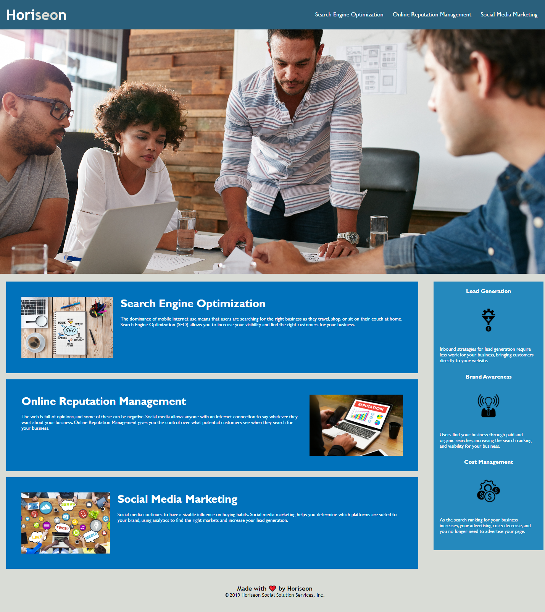

# Code-Refactor-Challenge

## Description - Code Refactor Challenge (Bootcamp Module 1 Challenge - Due on 05/12/2023)

### Refactor code on Horiseon Social Solution Services's website so that it meets web accessibility standards. 

- AS A marketing agency
- I WANT a codebase that follows accessibility standards.
- SO THAT our own site is optimized for search engines.

### We achieved this by

- Ensuring that semantic HTML elements can be found throughout the source code
- Made sure that HTML elements follow a logical structure independent of styling and positioning
- Image and icon elements contained accessible alt attributes
- Ensuring that heading attributes fall in sequential order (H1 through to H6)
- Title elements contain a concise, descriptive title

## Usage

- [Visit the Horiseon website deployed at the following link](https://aaron1490.github.io/Code-Refactor-Challenge/)
- [The repository for the website can be found here](https://github.com/aaron1490/Code-Refactor-Challenge)

Below is a screenshot of how the website should function and display:

## Credits

No collaborators, this was a solo project

Followed this tutorial partially (https://www.youtube.com/watch?v=lAOkx2yZESY) in order to get an idea of how to make the nav bar hover 4:04-4:15

Referenced (https://www.w3schools.com/html/html5_semantic_elements.asp) to better understanding of HTML Semantic Elements

## License

N/A - No license attributed

---

## Features

Nav bar goes bold up when hovered over with cursor
Nav bar functions and takes user to certain places on page when clicked
